# 13 service members were killed in Afghanistan. Here’s who they are

A devastating attack on Thursday, August 26, 2021 outside of the Hamid Karzai International Airport in Kabul, Afghanistan, killed 13 U.S. service members: eleven Marines, one Navy Corpsman, and one Army Soldier. The attack was one of the deadliest days for American forces in the past decade of the 20-year war, and is criticized as one that could have been avoided had President Joe Biden not called for the disastrous timeline of the withdrawal from the region, which all military members were supporting under the name Operational Freedom's Sentinel. Here's who the deceased are.

<!-- more -->

## Daegan William-Tyeler Page
???+ info
    **Rank:** Marine Corps Corporal

    **Age:** 23

    **Location:** Omaha, Nebraska

    ???+ quote
        Our beloved son, Corporal Daegan William-Tyeler Page, 23, was killed in Afghanistan yesterday. Daegan joined the U.S. Marine Corps after graduating from Millard South High School. He loved the brotherhood of the Marines and was proud to serve as a member of the 2nd Battalion, 1st Marine Regiment at Marine Corps Base Camp Pendleton, California.

        Daegan’s girlfriend Jessica, his mom, dad, step-mom, step-dad, 4 siblings, and grandparents are all mourning the loss of a great son, grandson, and brother. Daegan was raised in Red Oak, Iowa and the Omaha metro area and was a longtime member of the Boy Scouts. He enjoyed playing hockey for Omaha Westside in the Omaha Hockey Club and was a diehard Chicago Blackhawks fan. He loved hunting and spending time outdoors with his dad, as well as being out on the water. He was also an animal lover with a soft spot in his heart for dogs.

        Daegan always looked forward to coming home and hanging out with his family and many buddies in Nebraska. To his younger siblings, he was their favorite jungle gym and to his friends, he was a genuinely happy guy that you could always count on. After finishing his enlistment, Daegan planned to come home and go to a local trade school, possibly to become a lineman.

        Daegan will always be remembered for his tough outer shell and giant heart. Our hearts are broken, but we are thankful for the friends and family who are surrounding us during this time. Our thoughts and prayers are also with the other Marine and Navy families whose loved ones died alongside Daegan.

        - Statement from the Page family to [KETV](https://www.ketv.com/article/family-confirms-millard-south-grad-among-marines-killed-in-afghanistan-attack/37418995#)
    
    ???+ example "Images"
        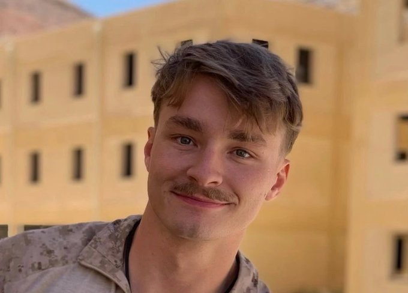{ align=left, loading=lazy }
        
    ???+ tip "Social Media"
        - [https://x.com/bennyjohnson/status/1431382594311106565?s=20](https://x.com/bennyjohnson/status/1431382594311106565?s=20)

    ???+ abstract "Additional Articles"
        - [KETV Omaha](https://www.ketv.com/article/family-confirms-millard-south-grad-among-marines-killed-in-afghanistan-attack/37418995#)

## Darin Taylor Hoover
???+ info
    **Rank:** Marine Corps Staff Sergeant

    **Age:** 31

    **Location:** Sandy, Utah

    ???+ example "Images"
        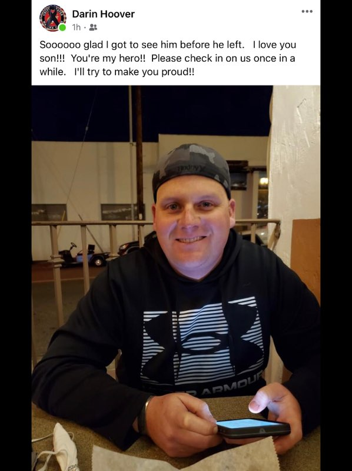{ align=left, loading=lazy }
        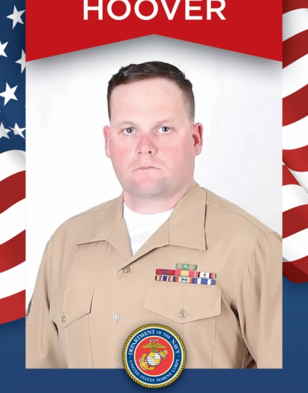{ align=left, loading=lazy }

    ???+ tip "Social Media"
        - [https://twitter.com/GovCox/status/1431379530313175040](https://twitter.com/GovCox/status/1431379530313175040)
        - [https://twitter.com/LGHendersonUtah/status/1431385832548536320](https://twitter.com/LGHendersonUtah/status/1431385832548536320)
        - [https://twitter.com/KSL_AlexCabrero/status/1431392814688968705](https://twitter.com/KSL_AlexCabrero/status/1431392814688968705)

    ???+ abstract "Additional Articles"
        - [KSLTV Salt Lake City](https://ksltv.com/471500/utah-marine-among-13-us-service-members-killed-in-kabul-attack/)

## David Lee Espinoza
???+ info
    **Rank:** Marine Corps Lance Corporal

    **Age:** 20

    **Location:** Rio Bravo, Texas

    ???+ example "Images"
        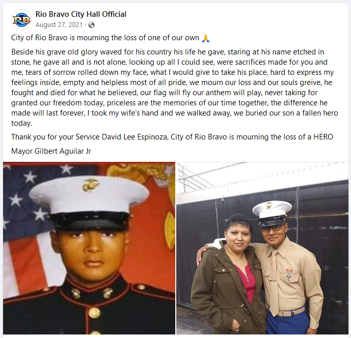{ align=left, loading=lazy }

    ???+ quote
        City of Rio Bravo is mourning the loss of one of our own 🙏

        Beside his grave old glory waved for his country his life he gave, staring at his name etched in stone, he gave all and is not alone, looking up all I could see, were sacrifices made for you and me, tears of sorrow rolled down my face, what I would give to take his place, hard to express my feelings inside, empty and helpless most of all pride, we mourn our loss and our souls greive, he fought and died for what he believed, our flag will fly our anthem will play, never taking for granted our freedom today, priceless are the memories of our time together, the difference he made will last forever, I took my wife’s hand and we walked away, we buried our son a fallen hero today.

        Thank you for your Service David Lee Espinoza, City of Rio Bravo is mourning the loss of a HERO

        - Gilbert Aguilar Jr, Mayor of Rio Bravo, TX

    ???+ tip "Social Media"
        - [https://www.facebook.com/permalink.php?story_fbid=355842769338776&id=100047391670968](https://www.facebook.com/permalink.php?story_fbid=355842769338776&id=100047391670968)
        - [https://www.facebook.com/cityoflaredo/photos/a.1137173819634628/4632972573388051/?type=3](https://www.facebook.com/cityoflaredo/photos/a.1137173819634628/4632972573388051/?type=3)

    ???+ abstract "Additional Articles"
        - [KGNS Laredo](https://www.kgns.tv/2021/08/27/us-marine-laredo-killed-kabul-attack/)
        - [The News Tribune](https://www.thenewstribune.com/news/nation-world/national/article253796423.html)

## Dylan R. Merola
???+ info
    **Rank:** Marine Corps Lance Corporal

    **Age:** 20

    **Location:** Rancho Cucamonga, California

    ???+ example "Images"
        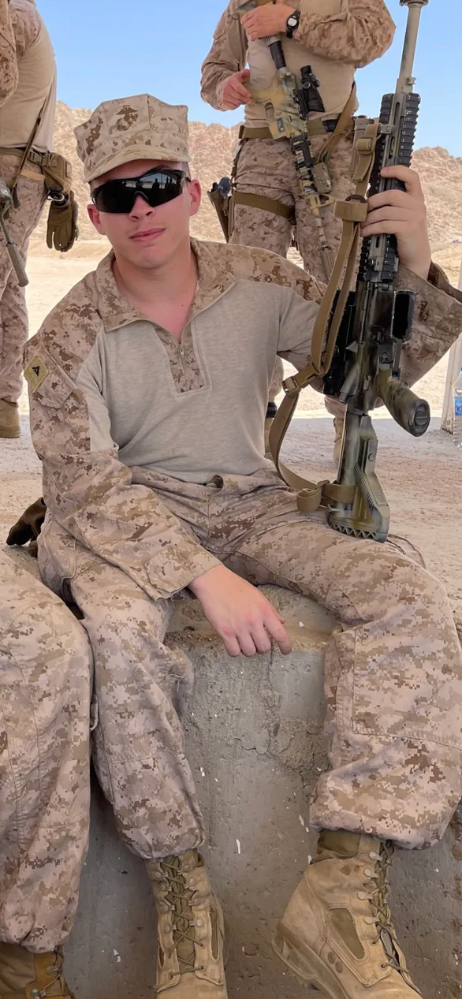{ align=left, loading=lazy }
        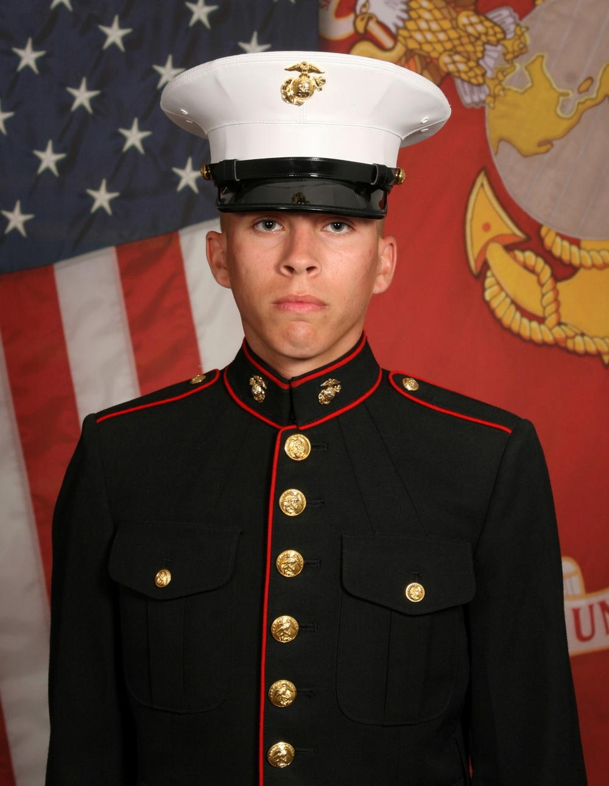{ align=left, loading=lazy }

    ???+ quote

    ???+ tip "Social Media"

    ???+ abstract "Additional Articles"
        - [USA Today](https://www.usatoday.com/story/news/nation/2021/08/28/marine-dylan-merola-honored-after-being-killed-afghanistan-attack/5640002001/)

## Humberto Sanchez
???+ info
    **Rank:** Marine Corps Corporal

    **Age:** 22

    **Location:** Logansport, Indiana

    ???+ example "Images"
        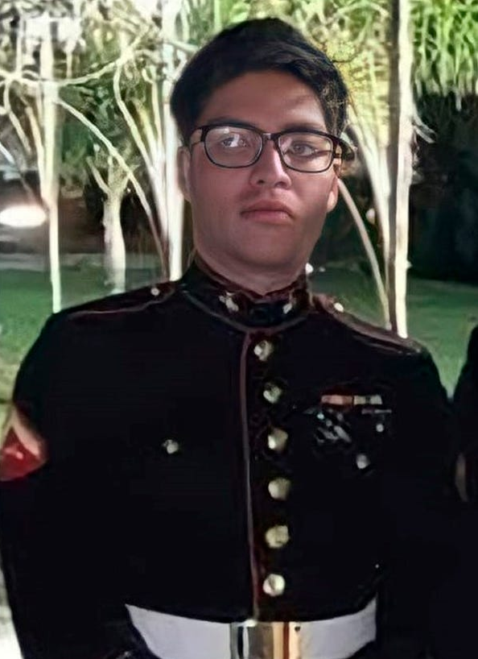{ align=left, loading=lazy }

    ???+ quote

    ???+ tip "Social Media"

    ???+ abstract "Additional Articles"

## Hunter Lopez
???+ info
    **Rank:** Marine Corps Corporal

    **Age:** 20

    **Location:** Riverside County, California

    ???+ example "Images"
        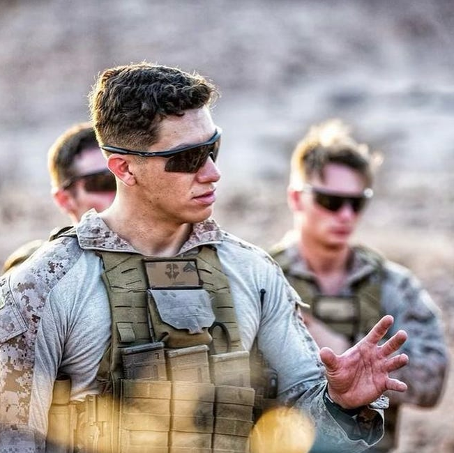{ align=left, loading=lazy }

    ???+ quote
         Hunter was the victim of vicious evil and was killed because he wore a United States Marine uniform with love and pride. Our entire community feels the anguish, and we mourn the death of Hunter, who answered the call to serve, defend and protect our nation.

        - Riverside Sheriff's Association

    ???+ tip "Social Media"
        - [https://www.facebook.com/RCSD.Official/posts/4922881337729001](https://www.facebook.com/RCSD.Official/posts/4922881337729001)

    ???+ abstract "Additional Articles"
        - [USA Today](https://www.usatoday.com/story/news/nation/2021/08/27/hunter-lopez-california-marine-killed-afghanistan-airport-attack/5623513001/)

## Jared Schmitz
???+ info
    **Rank:** Marine Corps Lance Corporal

    **Age:** 20

    **Location:** Wentzville, Missouri

    ???+ example "Images"
        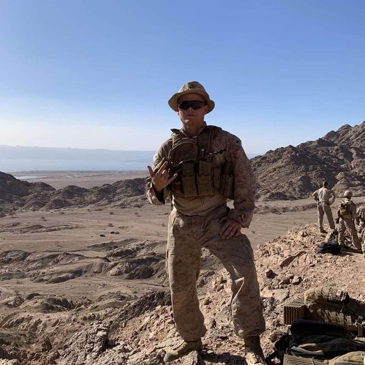{ align=left, loading=lazy }

    ???+ quote
        His life meant so much more. I’m so incredibly devastated that I won’t be able to see the man that he was very quickly growing into becoming.

        - Mark Schmitz, father of Jared Schmitz, to [KMOX](https://www.audacy.com/kmox/news/local/a-marine-from-the-stl-area-was-killed-in-afghanistan-thursday-father-confirms) radio

    ???+ tip "Social Media"
        [https://www.facebook.com/SchroerMO/posts/5036130306414531](https://www.facebook.com/SchroerMO/posts/5036130306414531)

    ???+ abstract "Additional Articles"
        - [KMOX St. Louis](https://www.audacy.com/kmox/news/local/a-marine-from-the-stl-area-was-killed-in-afghanistan-thursday-father-confirms)
        - [Fox 2 Now](https://fox2now.com/news/missouri/report-wentzville-man-among-13-marines-killed-in-afghanistan/)

## Johanny Rosario
???+ info
    **Rank:** Marine Corps Sergeant

    **Age:** 25

    **Location:** Lawrence, Massachusetts

    ???+ example "Images"
        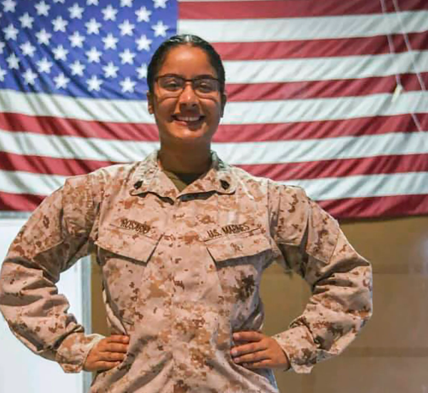{ align=left, loading=lazy }

    ???+ quote

    ???+ tip "Social Media"

    ???+ abstract "Additional Articles"

## Kareem Nikoui
???+ info
    **Rank:** Marine Corps Lance Corporal

    **Age:** 20

    **Location:** Indio, California

    ???+ example "Images"
        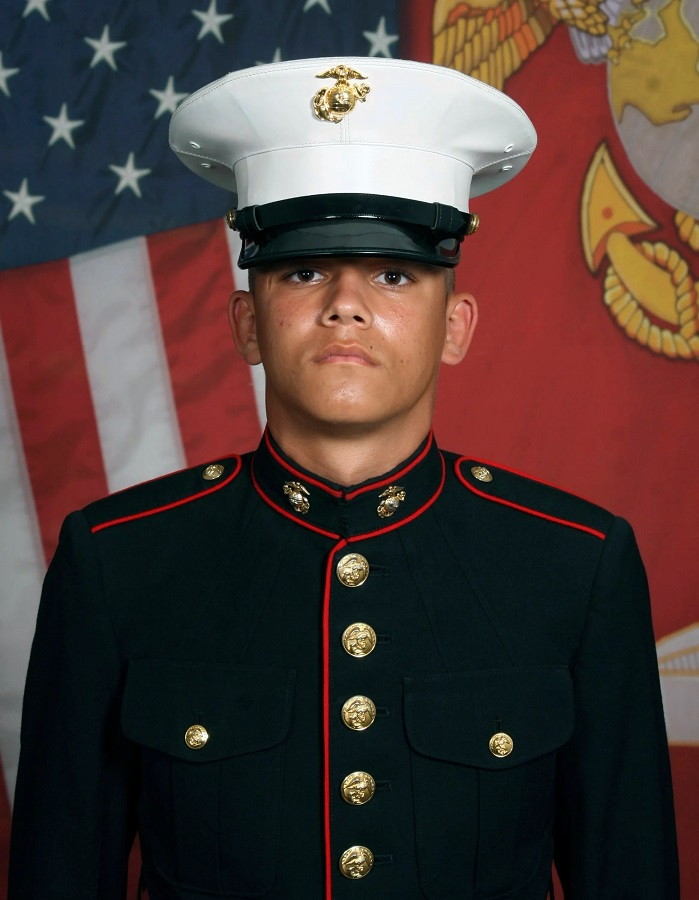{ align=left, loading=lazy }

    ???+ quote
        They sent my son over there as a paper pusher and then had the Taliban outside providing security…. I blame my own military leaders… Biden turned his back on him. That’s it.

        - Steve Nikoui, father of Kareem Nikoui, to [The Daily Beast](https://www.thedailybeast.com/slain-marine-kareem-nikouis-dad-vents-anger-at-military-biden-after-kabul-airport-blasts)

    ???+ tip "Social Media"

    ???+ abstract "Additional Articles"
        [What To Laugh](https://www.whattolaugh.com/news-marine-killed-afghanistan-brother-t-zan/)

## Maxton Soviak
???+ info
    **Rank:** Navy Fleet Marine Force Hospital Corpsman

    **Age:** 22

    **Location:** Berlin Heights, Ohio

    ???+ example "Images"
        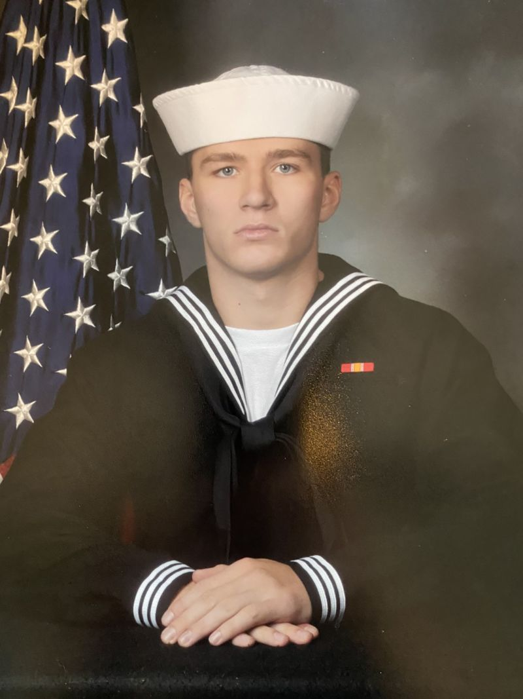{ align=left, loading=lazy }

    ???+ quote
        His final words to (Rachel) over FaceTime, when he was telling her goodbye was after she told him to be safe and he said ‘Don’t worry mom, my guys got me they won’t let anything happen to me.’ Today she realized that they all just went together.

        - Kip and Rachel Soviak, Max’s parents, in a statement to [CNN](https://www.cnn.com/2021/08/27/us/kabul-attack-us-service-members-killed/index.html).

    ???+ tip "Social Media"
        - [Final post to Maxton's Instagram](https://www.instagram.com/p/CP8rapJpOWy/)
        - [Marilyn Soviak, Max's sister post](https://www.instagram.com/p/CTFElTwnC_i/)

    ???+ abstract "Additional Articles"
        - [The Columbus Dispatch](https://www.dispatch.com/story/news/local/2021/08/27/ohio-navy-medic-max-soviak-killed-afghanistan-sandusky-edisonmarines-kabul-airport-attack/5615293001/)
        - [The Telegraph](https://www.telegraph.co.uk/world-news/2021/08/27/just-kid-us-medic-died-kabul-suicide-bombing-identified/)
        - [Sandusky Register](https://sanduskyregister.com/news/339579/local-sailor-killed-in-afghanistan/)
        - [New York Post](https://nypost.com/2021/08/27/first-us-service-member-killed-in-kabul-airport-attack-idd-as-max-soviak/)
        - [USA Today](https://www.usatoday.com/story/news/nation/2021/08/27/ohio-navy-medic-max-soviak-killed-afghanistan-kabul-airport-attack/5616050001/)
        - [Fox 8](https://fox8.com/news/hero-mourned-navy-corpsman-maxton-soviak-to-be-laid-to-rest-today/)
        - [Obituary](https://www.mormanfuneralhome.com/obituary/Maxton-Soviak)
        - [Foundation](https://maxtonsoviak.org)

## Nicole Gee
???+ info
    **Rank:** Marine Corps Sergeant

    **Age:** 23

    **Location:** Roseville, California

    ???+ example "Images"
        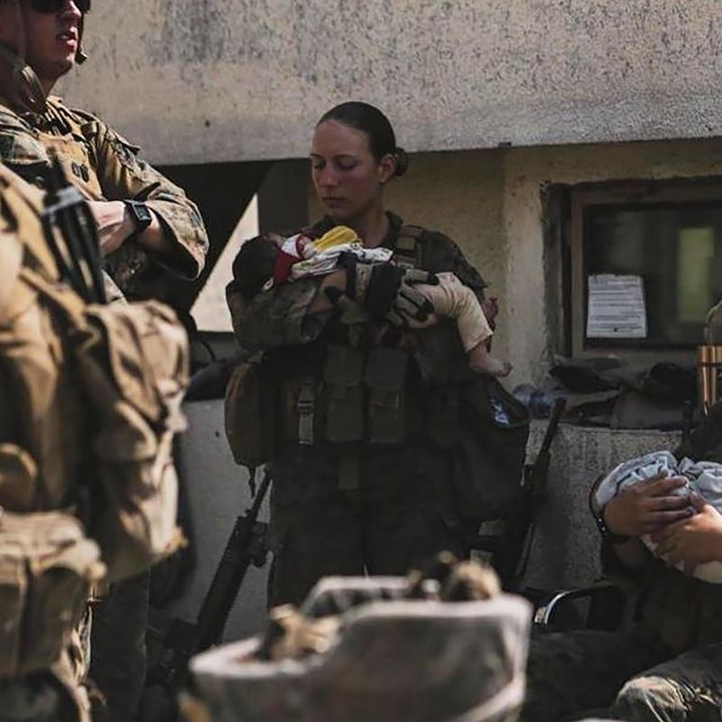{ align=left, loading=lazy }

    ???+ quote

    ???+ tip "Social Media"

    ???+ abstract "Additional Articles"

## Ryan Knauss
???+ info
    **Rank:** US Army Staff Sergeant

    **Age:** 23

    **Location:** Knoxville, Tennessee

    ???+ example "Images"
        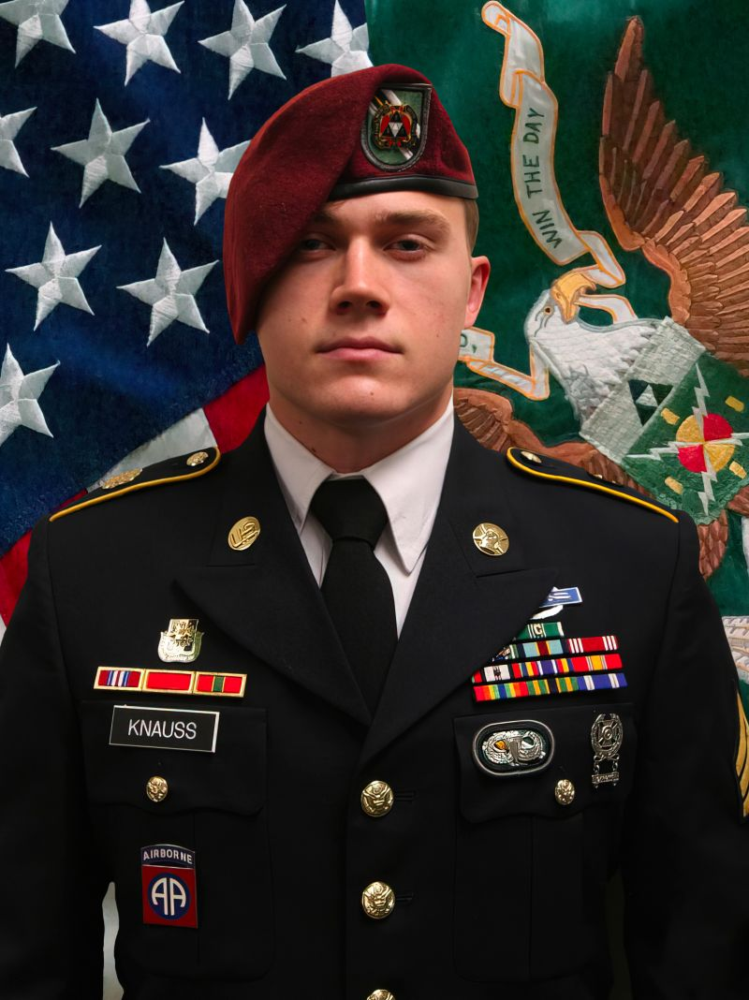{ align=left, loading=lazy}

    ???+ quote
        The president of the United States has the ability to help our troops, have enough men and women to stay safe. In all of our history, in all of the time that we have been fighting, where did you leave these men and women but at one airport, one location, one gate to funnel thousands through? And who did you trust? You trusted our enemy to allow who would come through.

        - Paula Knauss, mother of Ryan Knauss (quoted from [Fox News](https://www.foxnews.com/media/fallen-soldier-mother-blames-biden-trusted-enemy))

    ???+ tip "Social Media"
        - [https://twitter.com/GlennJacobsTN/status/1431383215810490368](https://twitter.com/GlennJacobsTN/status/1431383215810490368)

    ???+ abstract "Additional Articles"
        - [WBIR (NBC10 Knoxville, Tennessee)](https://www.wbir.com/article/news/national/military-news/family-gibbs-high-school-graduate-among-13-us-troops-killed-in-kabul-airport-attack/51-ac76d66a-c6d3-46a6-ab07-f99596c5cf87)
        - [WATE (ABC6 Knoxville, Tennessee)](https://www.wate.com/news/afghanistan/u-s-marine-from-knoxville-killed-in-terrorist-attack-at-afghanistan-airport/)
        - [Fox News](https://www.foxnews.com/media/fallen-soldier-mother-blames-biden-trusted-enemy)

## Rylee James McCollum
???+ info
    **Rank:** Marine Corps Lance Corporal

    **Age:** 20

    **Location:** Jackson, Wyoming

    ???+ example "Images"
        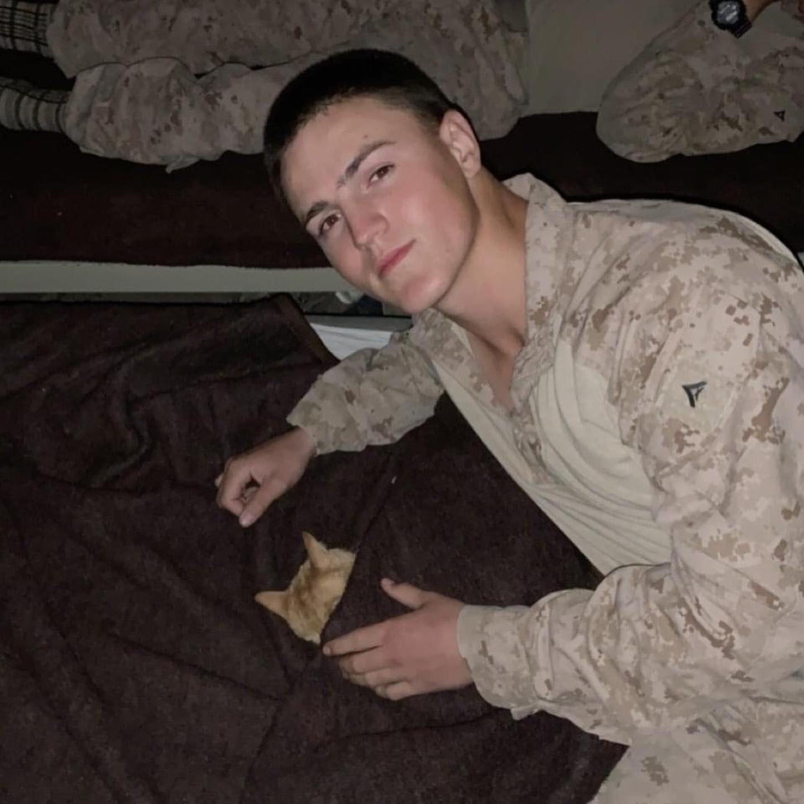{ align=left, loading=lazy }

    ???+ quote
        I never thought in a million years [my son] would die for nothing, for nothing, because that feckless, dementia-ridden piece of crap who decided he wanted a photo-op on September 11th. That’s what kills me. I wanted my son to represent our country, to fight for my country. But I never thought that a feckless piece of crap would send him to his death and smirk on television while he’s talking about people dying with his nasty smirk.

        - Kathy McCollum, mother of Rylee James McCollum, in a phone call to "The Wilkow Majority" / SiriusXM (video posted on [Twitter](https://twitter.com/ErrolWebber/status/1431598596923723782))

    ???+ tip "Social Media"
        - [https://twitter.com/ErrolWebber/status/1431598596923723782](https://twitter.com/ErrolWebber/status/1431598596923723782) (phone call to "The Wilkow Majority")
        - [https://twitter.com/jasonrantz/status/1431745831351185409](https://twitter.com/jasonrantz/status/1431745831351185409) (additional recording)

    ???+ abstract "Additional Articles"
