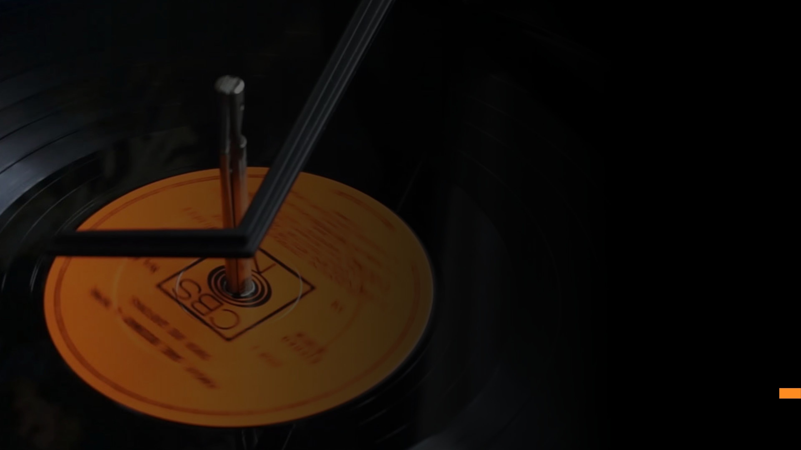

<head>
    

</head>

<body>
    

      
        

            <h1 style="font-size:clamp(27.894px, 1.743rem + ((1vw - 3.2px) * 2.285), 48px); text-transform:uppercase; color: white;">Broadcasting Solutions for your Business</h1>
            
Spice up your business with a broadcasting solution that makes you stand out and keeps customers coming back.

        

    

    

        

            <h2><i class="fa-solid fa-calendar-days"></i> Scheduled. 24/7.</h2>
            
You tell us when you want music. We’ll provide it on your schedule. And make any adjustments you want at any time with an easy-to-use web portal.

        

        

            <h2><i class="fa-solid fa-sliders"></i> Customizable</h2>
            
Your music instance is yours. And because of this architecture, we’re able to make each one unique. Maybe you don’t want that new pop song. No problem, we’ll get rid of it. With an almost limitless combination of programming, music choice, and anything else you throw in there, your instance will forever be unique to your business!

        

        

            <h2><i class="fa-solid fa-bolt"></i> Resilient</h2>
            
Modern hardware and software combined with experience provide an experience like never before to keep your business running and customers happy.

        

        

            <h2><i class="fa-solid fa-rocket"></i> Music. Fast.</h2>
            
It’s fast. Want to change the current playlist? Cue it up, the current song will finish, and you’re in business. Flip your classy restaurant to a nightclub (or whatever your fancy is) with a couple clicks. Whatever the situation, our system will respond almost instantly.

        

        

            <h2><i class="fa-solid fa-check"></i> Always Updated.</h2>
            
We keep up with the music industry so you don’t have to. New songs are added every week and you’ll benefit from it every time. Plus, we keep our equipment and software up-to-date so your experience is always flawless.

        

    

</body>

[Learn more about us and what we do! <i class="fa-solid fa-clipboard-list"></i>](./services/business-property.md){ .md-button }
